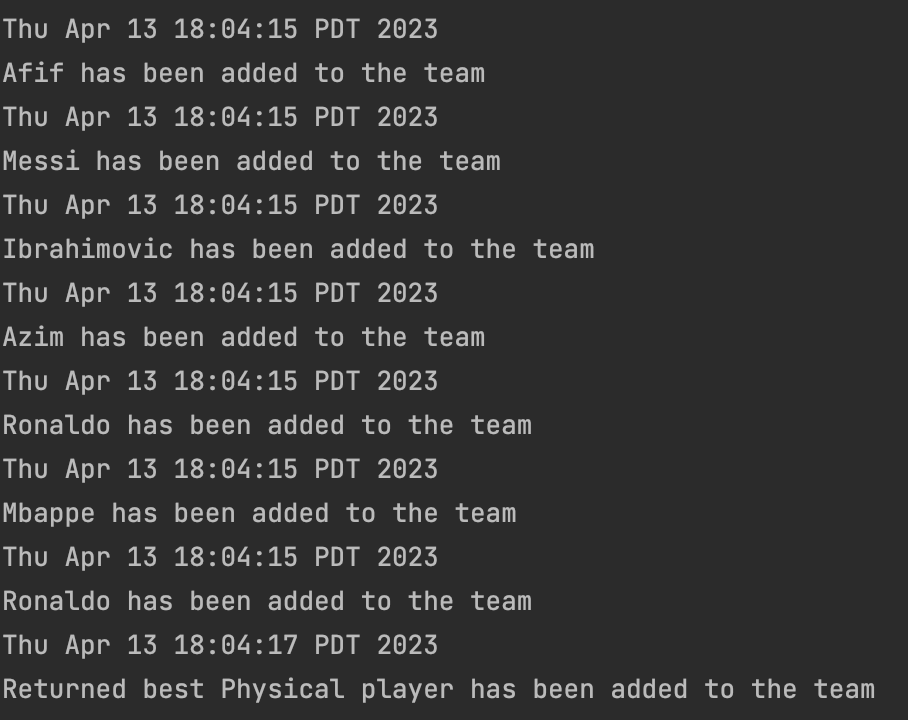

# TeamTracker
## An smart, efficient tool to track your team and their best player.

**What will the application do?**

This application is for the craziest and most passionate of FIFA fans. This app will enable the end user to do the following:

* Create a player with the stats for each attribute.
* Add players into the team that they create.
* View all the players in the team.
* Change the individual stat of a player in the team.

**Who will use it?**

FIFA is one of the most popular video games based on the popular sport, soccer. It has a game mode called ultimate where you have players with varying different attributes
some better than the other.

This app enables you to track your team, identify the best player for each attributes and build your best ultimate team.

**Why is this project of interest to you?**

I started watching football for the first time back during the 2014 FIFA World Cup. Having been mesmerized by Lionel Messi's ability, I began to watch FC Barcelona (club football), the team for which Messi was playing for. Ever since, football had become an integral
part of my life; I started watching every match possible. 

Due to time zones variations, I usually had to stay up till 12am or 11pm on school nights to watch the matches. Watching those matches helped me feel calm and happy, especially when I was under a lot
of stress from assignments, etc. It was a momentary break from life.

This sparked my interest in FIFA, to which I started playing quite regularly ever since.

I believe making a project on something I love will make it significantly more enjoyable, as I am passionate about the end-result. Why? Because I too will use it.

## ****User Stories****
* As a user, I want to be able to add a player to a team (list of players).
* As a user, I want to be able to view all the players in a team.
* As a user, I want to select a specific player and view the players stats.
* As a user, I want to be able to remove a player from the team (list of players).
* As a user, I want to change the stats of a specific player.
* As a user, I want to see the best player for each attribute.
* As a user, I want to save my team.
* As a user, I want to reload a saved team]

# Instructions for Grader

- You can generate the first required action related to adding Xs to a Y by clicking the Add Player button where you enter the stats for
the player and add it.
- You can generate the second required action related to adding Xs to a Y by clicking the Best Player button in the main menu which lets you choose
a specific stat and displays the best player for so.
- You can locate my visual component by clicking the Best Player button, where the pop-up window will display the FIFA logo at the bottom.
- You can save the state of my application by clicking the save team button on the main menu
- You can reload the state of my application by clicking the load team button on the main menu

## Phase 4: Task 2

## Phase 4: Task 3

The first refactoring change I would like to have made was to create a separate class for each stat of the players,
as they are distinctly different from one another. If I did this, I could use the Composite Pattern to make it much
easier to iterate over each and do any functionality required.

The second refactoring decision I could've made was make my UI more readable. In other words, I could have extracted
more methods from my already created methods to adopt the one method - one action policy. This would make debugging and 
understanding the program far easier.